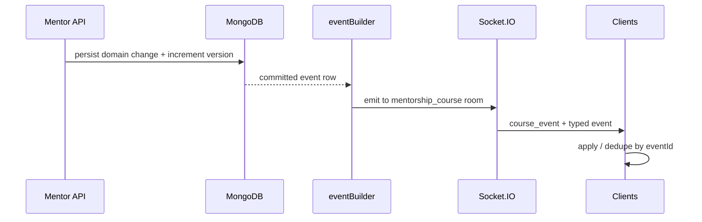

# MentorConnect real-time architecture

This document summarizes the event-sourced realtime layer for interviews, demos, and research appendices.

## Components

- **Versioned events** — Each course has a monotonic `realtimeVersion`. Every mutation appends a `RealtimeEvent` row (`eventId`, `version`, `type`, `payload`, audit fields).
- **Socket.IO** — Clients join `mentorship_<courseId>` via `join_course_room`. The server emits typed events plus a wrapped `course_event` envelope for incremental UI.
- **Sync API** — `GET /api/realtime/sync?courseId=&lastVersion=` returns missed events and a materialized snapshot (from `CourseSnapshot` or built on the fly) for recovery after reconnect or cold load.
- **Snapshots** — Periodic `CourseSnapshot` documents bound to `realtimeVersion` reduce replay cost for large histories.
- **Horizontal scale** — Optional `@socket.io/redis-adapter` when `REDIS_URL` is set so multiple Node processes share room fan-out.

## Event flow (happy path)



## Failure handling

| Scenario | Behavior |
|----------|----------|
| Client offline | On reconnect, `sync` returns events after `lastVersion` plus snapshot. |
| Socket emit skipped (chaos / network) | Client state may lag; sync repairs drift. |
| Transaction failure | `emitCourseEventsTransactional` falls back to non-transactional emits with logging. |
| AI unavailable | Roadmap / content paths use structured fallbacks; metrics record fallbacks and failures. |

## Scaling strategy

- **Stateless API** — Any app instance can serve HTTP; sticky sessions are not required for REST.
- **Socket.IO** — Use Redis adapter for multi-instance; clients reconnect to any node.
- **MongoDB** — Event collection indexed by `courseId` + `version`; TTL/archive scripts trim cold data.

## Observability

- **`GET /api/realtime/metrics`** — In-process counters (emits/sec, emit latency, AI stats, chaos counters when enabled).
- **`GET /api/realtime/dashboard`** (mentor) — Metrics + engine client count + per-room sizes for `mentorship_*` rooms.
- **Structured logs** — `interviewLog` helpers for sync recovery and system events (see `backend/src/observability/interviewLog.js`).

## Chaos mode (`CHAOS_MODE=true`)

For demos only: random emit delay, random drop, swapped emit order, duplicate `course_event` emits (clients dedupe), and periodic forced socket disconnects. **Do not enable in production.**

## Load testing

From `backend/`:

```bash
set LOADTEST_JWT=<bearer>
set LOADTEST_COURSE_ID=<courseId>
npm run loadtest:realtime
```

See `backend/scripts/loadTestRealtime.js` for tunables.

## Consistency & performance (hardening)

| Env | Meaning |
|-----|---------|
| `NODE_ENV=production` | Requires MongoDB replica set (transactions). Startup fails on standalone. |
| `REQUIRE_MONGODB_TRANSACTIONS=true` | Same as production for transaction enforcement (use on staging). |
| `REALTIME_EVENT_BATCH_MS` | Debounce window (ms) for coalescing socket emits per course; `0` disables. Default ~70. |
| `REALTIME_CACHE_TTL_MS` | Snapshot cache TTL for `buildSyncSnapshot`. |
| `PROGRESS_INTEGRITY_MS` | Interval for background course/mentorship progress drift repair (default 5m). |

## UI surfaces

- **Mentor → Realtime ops** (`/mentor/ops`) — Live dashboard, course timeline, export, replay, and version inspection.
